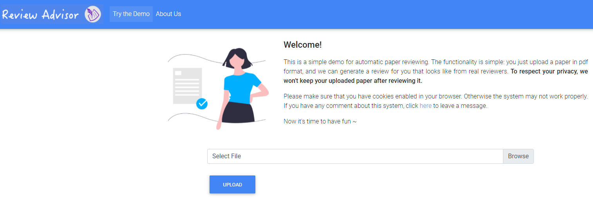

### Authors: [Weizhe Yuan](https://yyy-apple.github.io/), [Pengfei Liu](http://pfliu.com/), [Graham Neubig](http://www.phontron.com/)

# Outline
* ### [Motivation](https://github.com/neulab/ReviewAdvisor#motivation-1)
* ### [Online Demo](https://github.com/neulab/ReviewAdvisor#demo)
* ### [Dataset: AutoReview](https://github.com/neulab/dataset)
* ### [Model: ReviewAdvisor](https://github.com/neulab/ReviewAdvisor#model-1)
* ### [Rethinking: Challenges](https://github.com/neulab/ReviewAdvisor#challenges-1)
* ### [Acknowledgement](https://github.com/neulab/ReviewAdvisor#acknowledgement-1)
* ### [Bib](https://github.com/neulab/ReviewAdvisor#bib-1)

# Motivation

### Can We Automate Scientific Reviewing?
### Heavy workload on reviewing papers?  ReviewAdvisor helps out!

# Demo

### Have a [TRY](http://review.nlpedia.ai/)

# Dataset

# Model

# Challenges

# Acknowledgement

#### This work cannot be accomplished without the help of many researchers.
We would like to thank people for their generous support, especially,
Gábor Berend, Zhouhan Lin, William W. Cohen, Pengcheng Yin, Tiange Luo, Yuki M. Asano, Junjie Yan, Tuomas Haarnoja, Dandan Guo, Jie Fu, Lei Chen, Jinlan Fu, Jiapeng Wu, Wenshan Wang, Ziyi Dou

# Bib
