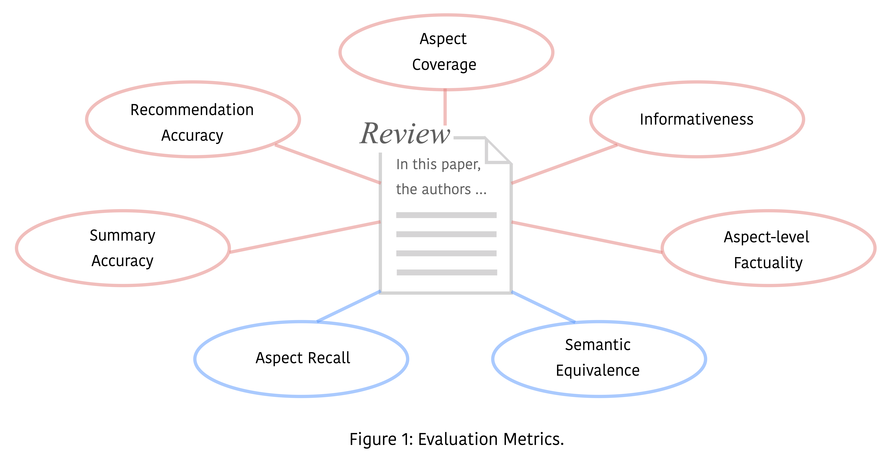
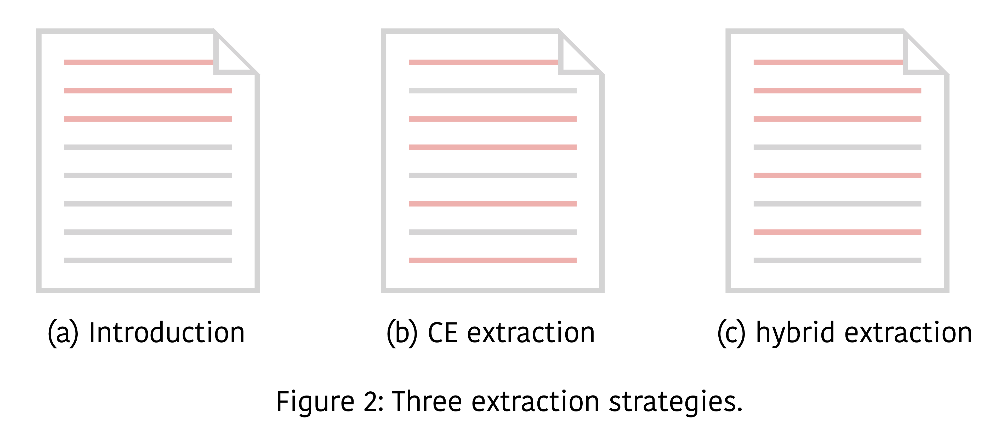
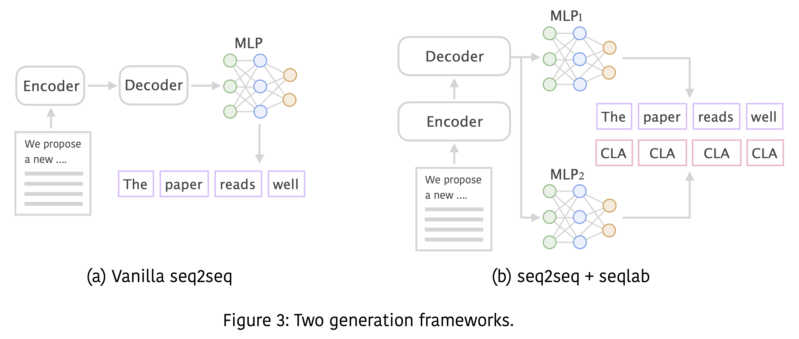
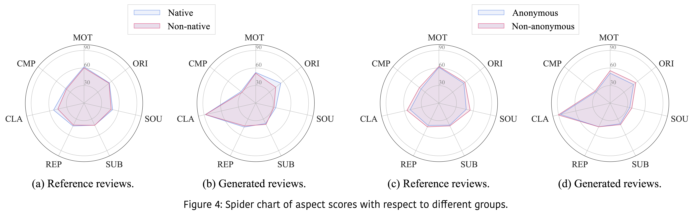
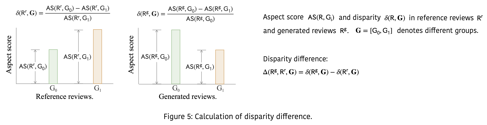

### Authors: [Weizhe Yuan](https://yyy-apple.github.io/), [Pengfei Liu](http://pfliu.com/), [Graham Neubig](http://www.phontron.com/)

# Outline
* ### [Motivation](https://github.com/neulab/ReviewAdvisor#motivation)
* ### [Online Demo](https://github.com/neulab/ReviewAdvisor#demo)
* ### [Dataset: AutoReview](https://github.com/neulab/dataset)
* ### [Evaluation](https://github.com/neulab/ReviewAdvisor#evaluation)
* ### [Model: ReviewAdvisor](https://github.com/neulab/ReviewAdvisor#model)
* ### [Fairness: Bias Analysis](https://github.com/neulab/ReviewAdvisor#bias)
* ### [Rethinking: Challenges](https://github.com/neulab/ReviewAdvisor#challenges)
* ### [Acknowledgement](https://github.com/neulab/ReviewAdvisor#acknowledgement-1)
* ### [Bib](https://github.com/neulab/ReviewAdvisor#bib-1)

# Motivation

* ### Can We Automate Scientific Reviewing?
* ### How will we know if we succeed?
* ### Heavy workload on reviewing papers?  ReviewAdvisor helps out!

# Demo

### Have a [TRY](http://review.nlpedia.ai/)

# Dataset
The details of our dataset can be found [here](https://github.com/neulab/ReviewAdvisor/blob/main/data/README.md)

# Evaluation
We first define two high-level objectives of scientific peer review following [Jefferson et al. (2002a)](https://jamanetwork.com/journals/jama/fullarticle/194989). and [Smith (2006)](https://www.ncbi.nlm.nih.gov/pmc/articles/PMC1420798/).

1. Selecting high-quality submissions for publication.
2. Improving different aspects  of a paper by providing detailed comments.

We then make a step towards review evaluation for scientific papers by proposing seven quantifiable metrics that can characterize a review from multiple perspectives. The evaluation metrics are shown in Fig.1, red represents absolute metric and blue represents relative metric.

# Model
We decompose review generation into two steps, and consider using a *extract-then-generate* paradigm. 

We consider three extraction strategies, which can be visualized in Fig.2.
1. Section-based Extraction
2. Cross-entropy Method Extraction
3. Hybrid Extraction

We consider two generation frameworks, which can be visualized in Fig.3.
1. Vanilla Sequence to Sequence
2. Jointly Sequence to Sequence and Sequence Labeling

# Bias
To characterize potential bias existing in reviews, we define aspect score as the percentage of positive occurrences with respect to each review's aspects.

## Absolute bias
Absolute bias can be visualized directly by plotting the aspect scores of different groups w.r.t each aspect. An example is shown in Fig.4.

## Relative bias
Relative bias quantifies the relative favor for certain groups between human reviewers and system reviewers. And we define a metric called disparity difference to measure relative bias. The calculation of disparity difference can be visualized in Fig.5.

# Challenges

We summairze eight eight challenges in the pursuit of a good review generation system.
1. Model
    - Long Document Modeling
    - Pre-trained Model for Scientific Domain
    - Structure Information
    - External Knowledge
2. Dataset
    - More Open, Fine-grained Review Data
    - More Accurate and powerful Scientific Paper Parser
3. Evaluation
    - Fairness and Bias in Generated Text
    - Reliability

# Acknowledgement

#### This work cannot be accomplished without the help of many researchers.
We would like to thank people for their generous support, especially,
Gábor Berend, Zhouhan Lin, William W. Cohen, Pengcheng Yin, Tiange Luo, Yuki M. Asano, Junjie Yan, Tuomas Haarnoja, Dandan Guo, Jie Fu, Lei Chen, Jinlan Fu, Jiapeng Wu, Wenshan Wang, Ziyi Dou, Yixin Liu, Junxian He, Bahetiyaer Bare, Saizheng Zhang, Jiateng Xie, Spyros Gidaris.

# Bib
