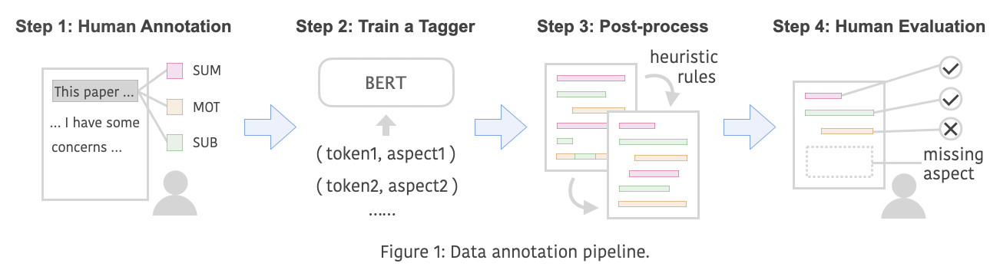
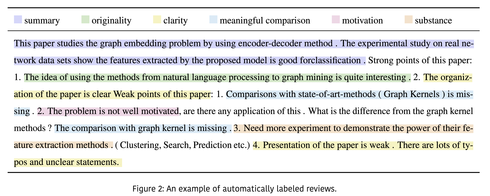

# Dataset
## Data Collection
We crawled ICLR papers from 2017-2020 through [OpenReview](https://openreview.net) and NIPS papers from 2016-2019 through [NIPS Proceedings](http://papers.nips.cc).
For each paper's review, we keep metadata information as much as possible.

Specifically, for each paper, we include following metadata information that we can obtain from the review web page:


- **Reference reviews**, which are written by a committee member.
  
- **Meta reviews**, which are commonly written by an area chair (senior committee member).
  
- **Decision**, which denotes a paper's final "reject" or "accept" decision.
  
- **Other information**, like url, title, authors and etc.

<br>

The basic statistics of our dataest is shown in the table below. Note that NIPS only provide reviews for accepted papers to the public.


|  | ICLR | NIPS | Both |
|:---| ---:| ---:| ---:|
| Accept | 1859 | 3685 | 5544 |
| Reject | 3333 | 0 | 3333|
| Total | 5192 | 3685 | 8877 |
| Avg. Full Text Length | 7398 | 5916 | 6782 |
| Avg. Review Length | 445 | 411 | 430 |
| # of Reviews | 15728 | 12391 | 28119 |
| # of Reviews per Paper | 3.03 | 3.36 | 3.17 |

<br>
<br>

## Our Data Format

For each paper, we give it a unique id, and create three json files for it.
- One for paper metadata: we include the following information: conference, decision, url, title, authors.

- One for paper content: we used [Allenai Science-parse](https://github.com/allenai/science-parse) to parse the pdf, and keep the output json format.

- One for paper review: we include both general reviews and meta reviews.

<br>
<br>

# Aspect-enhanced Review Dataset
Scientific peer reviews exhibit certain internal structure as shown in the Fig.1. They commonly start with a paper summary, followed by different aspects of opinions, together with evidence. However, in practice, this useful information cannot be obtained directly. Considering that fine-grained information (e.g., aspect) plays an essential role in review evaluation, we conduct human annotation of those reviews. 

<br>

## Review Structuralization
We define a typology that contains 8 aspects following ACL review guidance with small modifications, which are **Summary**, **Motivation**, **Originality**, **Soundness**, **Substance**, **Replicability**, **Meaningful Comparison** and **Clarity**.

<br>

## Aspect Annotation
Overall, the data annotation involves four steps that are shown in Fig.1.

<br>



<br>
<br>

Four Steps:

- Step 1: We set up a data annotation platform using [Doccano](https://github.com/doccano/doccano) and asked six students from ML/NLP background to annotate 1000 reviews. 
- Step 2: We formalized the problem as a sequence labeling problem and used partial annotated data to train an aspect tagger (BERT + MLP). Then we used this trained tagger to annotate the rest of our dataset.
- Step 3: We used seven heuristic rules to refine the predicted spans.
- Step 4: We asked three students from ML/NLP background to evaluate our data quality.

The details for the above four steps can be found in Section 3.3.2 of our paper.

<br>

An example of automatically annotated review in our dataset is shown in Fig.2. In this figure, we aggregate both positive and negative aspect to avoid visual burden. In our dataset, we have aspect polarity information as well. For example, in the below figure, the first clarity aspect is positive and the second is negative.



<br>
<br>

## Our Data Format
We provide two data formats:
- Standard sequence labeling format. Each review is separated by a blank line, each word is followed by a space and its aspect.<br>
```
This summary
work summary
studies summary
the summary
predictive summary
uncertainty summary
...
```
- jsonlines format. Each review is in a json format.
```json
{
    "id": "ICLR_2020_1123", 
    "text": "This work studies the predictive uncertainty...", 
    "labels": [
        [0, 1029, "summary"], 
        [1030, 1201, "motivation_positive"], 
        [1204, 1292, "clarity_positive"], 
        [1293, 1409, "soundness_negative"], 
        [1555, 1656, "substance_negative"], 
        [1973, 1998, "meaningful_comparison_negative", 
        [3389, 3508, "soundness_negative"]
    ]
}
```

